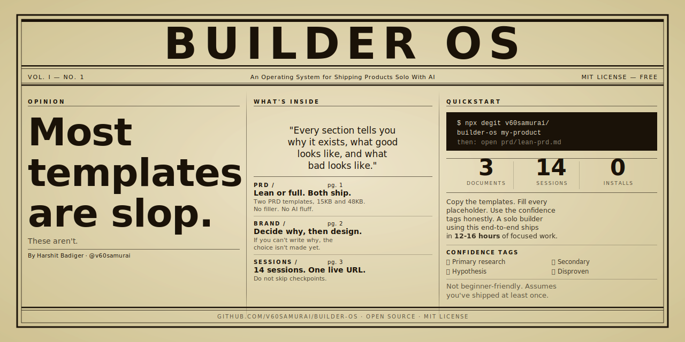

<div align="center">
  
</div>

# Builder OS

> An operating system for shipping products solo with AI.

PRD → Brand Guide → Session Playbook. The three documents I use to take a product from idea to live URL, working alone with Claude Code.

These templates have shipped real products. They are opinionated. They tell you what to do, not what you *could* do.

---

## What's inside

| Folder | What it is | Use when |
|--------|------------|----------|
| [`prd/`](./prd) | One PRD template (phase-split; discovery rigor + operational spine). Older lean/full/org kept in `archive/`. | You're deciding *what* to build |
| [`erd/`](./erd) | The Engineering Requirement Document template — the ⭐ one structural decision, schema, API contract, chunk map + boundary contracts | You're deciding *how* it's built, before code |
| [`discovery/`](./discovery) | Idea log + discovery brief | You're figuring out *if* it's worth building, before you write the PRD |
| [`brand/`](./brand) | Two brand-guide templates: quick and full | You're choosing *how it looks* |
| [`sessions/`](./sessions) | A mode-aware implementation playbook (greenfield + extends-existing), built against the ERD's chunk map | You're *building it* |
| [`postmortem/`](./postmortem) | Postmortem template | You've shipped and need to close the loop |
| [`skills/`](./skills) | Claude Code skills: writing/updating/gating PRDs, writing/gating the ERD, running sessions, visualizing brand guides. This repo root is a Claude Code plugin. | You're using Claude Code and want these enforced, not just suggested |
| [`pro/`](./pro) | The full 5-mode pipeline connecting everything above | You want the templates wired together, not used as separate folders |
| [`examples/`](./examples) | Real filled-out examples from shipped products | You want to see one done |

---

## Where to start

```
Not sure this is worth building ──→ discovery/idea-log.md → discovery/discovery-brief.md
Deciding WHAT to build ───────────→ prd/prd.md   (cut optional sections for a small bet)
Deciding HOW to build it ─────────→ erd/erd-template.md   (pick greenfield or extends-existing)
Already have PRD + ERD, building ─→ sessions/SESSION_PLAYBOOK.md
Just need design rules ───────────→ brand/ standalone
Need a worked example to copy ───→ examples/
Want it all wired together ───────→ pro/README.md (the 5-mode pipeline)
```

The spine: **discovery → PRD (what) → ERD (how) → sessions (build) → postmortem (learn)**, each gated before the next.

---

## Quickstart

Copy the templates into your project:

```bash
npx degit v60samurai/builder-os my-product
cd my-product
```

Then:

1. Open `prd/prd.md`. Fill every `[bracket]` placeholder (the session playbook uses `{{double-brace}}` ones). Use the confidence tags (🟢🟡🔵🔴) honestly. Run `/prd-gate` before moving on.
2. Open `erd/erd-template.md`. Pick a mode (greenfield / extends-existing), name the ⭐ one structural decision, derive the schema, cut the chunks. Run `/erd-gate` before any code.
3. Open `brand/quick-brand-guide.md`. Decide your colors, type, voice. Write down *why* you chose each one.
4. Open `sessions/SESSION_PLAYBOOK.md`. Follow the sessions in order. Do not skip checkpoints.

A solo builder using this end-to-end ships in roughly 12-16 hours of focused work.

Want the templates wired together instead of used as three separate folders — gates between stages, a discovery step before the PRD, a postmortem after launch? See [`pro/README.md`](./pro/README.md) for the full pipeline.

---

## Install as a Claude Code plugin (optional)

The templates above work with any editor — copy the markdown, fill it in. If you use Claude Code and want the skills enforced instead of just followed:

```bash
git clone https://github.com/v60samurai/builder-os.git
cc --plugin-dir /path/to/builder-os
```

That loads all five skills in [`skills/`](./skills) for the session. Each one is directly invokable by name, or triggers automatically when the context matches:

| Command | Does |
|---|---|
| `/prd-writer` | Write or review a PRD |
| `/prd-updater` | Integrate new information into an existing PRD without bolting on an "update note" |
| `/prd-gate` | Check whether a PRD is actually ready — placeholders, confidence tags, non-goals, guardrail metric |
| `/erd-writer` | Write the engineering spec (ERD) from a PRD — schema, API, chunk map. Two modes: greenfield / extends-existing |
| `/erd-gate` | Check the ERD is safe to build — ⭐ structural decision resolved, no load-bearing hypothesis, boundary contracts complete |
| `/session-runner` | Run the mode-aware build playbook with done-checks and checkpoints enforced |
| `/brand-guide-visualizer` | Turn a filled-out brand guide into a single-file HTML reference |

No marketplace listing yet, so `/plugin marketplace add` won't find it — `--plugin-dir` against a local clone is the way to load it today.

---

## Philosophy

Most templates are slop.

They give you sections without telling you what a good answer looks like. They use placeholder text that an AI happily fills with confident nonsense. They optimise for the writer feeling done, not for the reader making decisions.

Builder OS does the opposite:

- Every section tells you *why* it exists, what *good* looks like, and what *bad* looks like.
- Confidence tags (🟢 primary research, 🟡 secondary, 🔵 hypothesis, 🔴 disproven) force you to own how solid each claim is.
- Brand decisions get defended in writing. If you can't write *why*, the choice isn't made yet.
- The session playbook has checkpoints. Discovering a broken foundation in session 8 costs 3x what it costs in session 2.

The result: when you hand these docs to Claude Code (or a teammate), they make the decisions *you* would have made. No defaults. No drift. No slop.

---

## What this is NOT

- A framework you're locked into. The templates are plain markdown — copy, fill in, done. The Claude Code plugin is opt-in on top of that, not a requirement.
- A SaaS. No login, no pricing, no roadmap dictated by a Stripe dashboard.
- A starter kit. No code. Bring your own stack.
- Beginner-friendly. Assumes you've shipped at least once and know what a PRD is for.
- Stack-agnostic. The session playbook assumes Next.js + Supabase + FastAPI. Adapt as needed.

---

## Roadmap

Templates I'll add next (PRs welcome):

- `voice/` — brand voice corpus + microcopy patterns
- `adr/` — architecture decision records
- `eval/` — MVP completeness rubric
- `growth/` — post-launch experiment template
- `.cursorrules` — equivalent guard for Cursor users

`discovery/`, `postmortem/`, and Claude Code skills (`skills/`) shipped in 0.3.0 — see [`pro/README.md`](./pro/README.md) for how they connect. See [CHANGELOG.md](./CHANGELOG.md) for the full history.

---

## Contributing

Issues, PRs, and new template ideas are welcome. Read [CONTRIBUTING.md](./CONTRIBUTING.md) first. The voice is opinionated, and PRs that dilute it won't merge.

---

## Credits

`skills/prd-writer/` and `skills/prd-updater/` were originally written by Rohan Shah.

---

## License

MIT. Harshit Badiger ([@v60samurai](https://github.com/v60samurai)).

Use these in any project. Fork them. Sell them. Rip them apart. If they ship something for you, a star (and a tag on the post you ship from them) is the thanks I'd love.
