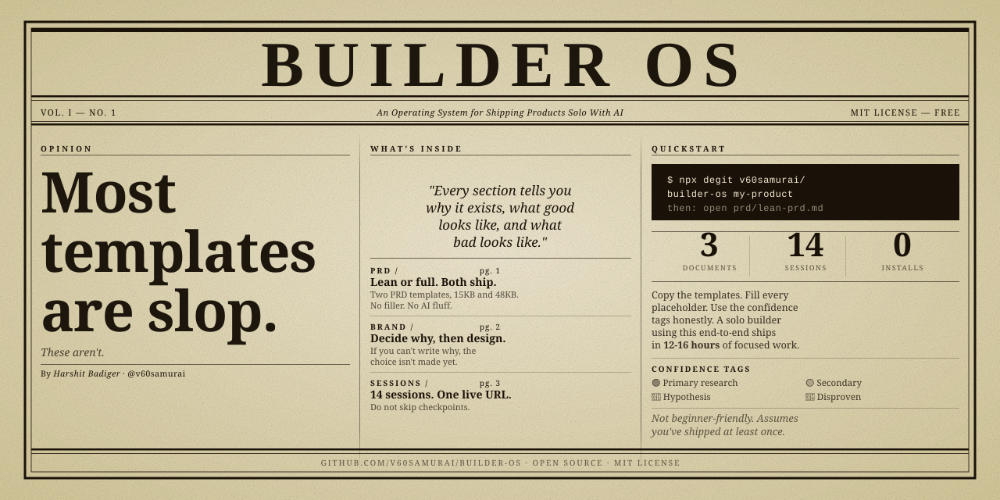
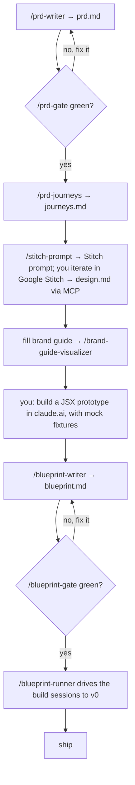

<div align="center">
  
</div>

# Builder OS

> An operating system for shipping products solo with AI.

PRD → Journeys → Design → Brand → Prototype → Blueprint → ship. The pipeline I use to take a product from idea to live URL, working alone with Claude Code.

These templates have shipped real products. They are opinionated. They tell you what to do, not what you *could* do.

---

## What's inside

| Folder | What it is | Use when |
|--------|------------|----------|
| [`prd/`](./prd) | One PRD template (phase-split; discovery rigor + operational spine). Older lean/full/org kept in `archive/`. | You're deciding *what* to build |
| [`blueprint/`](./blueprint) | The Blueprint — one doc merging the engineering spec, technical reference, and step-by-step build plan: the ⭐ structural decision, schema, API contracts, chunk map, env + integrations, and the session-by-session sequence to v0 | You're deciding *how* it's built, and building it |
| [`discovery/`](./discovery) | Idea log + discovery brief | You're figuring out *if* it's worth building, before you write the PRD |
| [`brand/`](./brand) | Two brand-guide templates: quick and full | You're choosing *how it looks* |
| [`sessions/`](./sessions) | The go-to-market launch push (`FINAL_PUSH.md`) — the build plan itself now lives in the Blueprint | You're about to ship |
| [`postmortem/`](./postmortem) | Postmortem template | You've shipped and need to close the loop |
| [`skills/`](./skills) | Claude Code skills: writing/updating/gating PRDs, writing/gating/running the Blueprint, visualizing brand guides. This repo root is a Claude Code plugin. | You're using Claude Code and want these enforced, not just suggested |
| [`pro/`](./pro) | The full 5-mode pipeline connecting everything above | You want the templates wired together, not used as separate folders |
| [`examples/`](./examples) | Real filled-out examples from shipped products | You want to see one done |

---

## The flow

One pipeline, idea to live URL. Each step produces an artifact the next step reads — nothing is re-derived downstream. Gate before moving on.

```
discovery ─▶ PRD ─▶ journeys ─▶ design ─▶ brand ─▶ prototype ─▶ Blueprint ─▶ ship
  (if?)     (what)  (flows)    (Stitch)  (look)   (feel)       (how + build)
```

| # | Step | You produce | Skill / tool |
|---|------|-------------|--------------|
| 0 | **Discovery** *(optional)* | `discovery/idea-log.md` → `discovery-brief.md` — is it worth building? | — |
| 1 | **PRD** | `prd/prd.md` — what + why, every load-bearing claim confidence-tagged | `/prd-writer`, `/prd-updater` · gate `/prd-gate` |
| 2 | **Journeys** | `journeys.md` — personas, Mermaid flow per journey, screen inventory + state matrix | `/prd-journeys` |
| 3 | **Design** | `design.md` — the visual spec | `/stitch-prompt` → iterate in [Google Stitch](https://labs.google/stitch) → back into Claude Code via the Stitch MCP |
| 4 | **Brand** | `brand/quick-brand-guide.md` (or `full-`) — palette, type, voice, and the *why* behind each | fill it · render `/brand-guide-visualizer` |
| 5 | **Prototype** | a claude.ai **JSX artifact** — clickable, with realistic mock fixtures | claude.ai Artifacts *(the fixtures become the Blueprint's schema source)* |
| 6 | **Blueprint** | `blueprint/blueprint-template.md` — spec + technical reference + step-by-step build plan | `/blueprint-writer` · gate `/blueprint-gate` |
| 7 | **Implement** | the running app, to v0 | `/blueprint-runner` drives Part 3's build sessions |
| 8 | **Postmortem** *(optional)* | `postmortem/postmortem-template.md` — results vs the PRD, one lesson as a rule | — |

How the artifacts chain: journeys' **screen inventory** drives the Stitch design prompt and, later, the prototype; the prototype's **fixtures** drive the Blueprint's schema (greenfield mode); **design.md + journeys** drive the Blueprint's frontend change-list and chunk map. `journeys.md` and `design.md` are generated per-project next to your PRD — not templates in this repo.

The spine: **discovery → PRD (what) → journeys → design → brand → prototype → Blueprint (how + build) → postmortem (learn)**, each gated before the next.

---

## Quickstart

Copy the templates into your project:

```bash
npx degit v60samurai/builder-os my-product
cd my-product
```

Then:

1. **PRD** — open `prd/prd.md`, fill every `[bracket]` placeholder (the Blueprint uses `{{double-brace}}` ones), tag claims 🟢🟡🔵🔴 honestly. Gate with `/prd-gate`.
2. **Journeys** — `/prd-journeys` reads the PRD and writes `journeys.md`: a flow per journey plus a screen inventory the next steps build against.
3. **Design** — `/stitch-prompt` turns journeys' screen inventory into a Google Stitch prompt; iterate in Stitch, bring the design back as `design.md` via the Stitch MCP.
4. **Brand** — fill `brand/quick-brand-guide.md` (colors, type, voice, and *why*), locking in the look the design pass established; render it with `/brand-guide-visualizer`.
5. **Prototype** — build a clickable JSX artifact in claude.ai with realistic mock fixtures. This is where the real data shape gets discovered — the Blueprint derives its schema from it.
6. **Blueprint** — `/blueprint-writer` fills `blueprint/blueprint-template.md` (spec + technical reference + build plan). Pick a mode, name the ⭐ structural decision, derive the schema, cut the chunks, sequence the sessions. Gate with `/blueprint-gate` before any code.
7. **Build** — `/blueprint-runner` drives Part 3's sessions in order, done-checks and checkpoints enforced.

A solo builder using this end-to-end ships in roughly 12-16 hours of focused work.

Want the templates wired together instead of used as three separate folders — gates between stages, a discovery step before the PRD, a postmortem after launch? See [`pro/README.md`](./pro/README.md) for the full pipeline.

---

## Install as a Claude Code plugin (optional)

The templates above work with any editor — copy the markdown, fill it in. If you use Claude Code and want the skills enforced instead of just followed, install it as a plugin:

```bash
claude plugin marketplace add v60samurai/builder-os
claude plugin install builder-os@builder-os
```

(Or add it through the interactive `/plugin` menu.) That loads all nine skills in [`skills/`](./skills) for every session — one per flow step. Each is directly invokable by name, or triggers automatically when the context matches:

| Command | Step | Does |
|---|---|---|
| `/prd-writer` | PRD | Write or review a PRD |
| `/prd-updater` | PRD | Integrate new information into an existing PRD without bolting on an "update note" |
| `/prd-gate` | PRD | Check whether a PRD is actually ready — placeholders, confidence tags, non-goals, guardrail metric |
| `/prd-journeys` | Journeys | Turn the PRD into `journeys.md` — flows per journey + a screen inventory with state matrix |
| `/stitch-prompt` | Design | Turn journeys' screen inventory into a Google Stitch prompt; the design comes back as `design.md` via MCP |
| `/brand-guide-visualizer` | Brand | Turn a filled-out brand guide into a single-file HTML reference |
| `/blueprint-writer` | Blueprint | Write the Blueprint from a PRD — spec (schema, API, chunk map) + technical reference (env, integrations, security) + step-by-step build plan. Two modes: greenfield / extends-existing |
| `/blueprint-gate` | Blueprint | Check the Blueprint is safe to build — ⭐ structural decision resolved, no load-bearing hypothesis, boundary contracts + env complete, every session verifiable |
| `/blueprint-runner` | Implement | Drive the Blueprint's build sessions with done-checks and checkpoints enforced |

### Updating

Pull the latest skills after a new version ships:

```bash
claude plugin marketplace update builder-os
claude plugin update builder-os@builder-os
```

Restart Claude Code (or start a new session) for the updated skills to load.

---

## How to use it

Once the plugin is installed, you run the pipeline by invoking the skills in order. Each one either writes a document or checks it. You make the product decisions inside those documents, and you own the two steps the skills cannot do for you: building the prototype in claude.ai and iterating the visual design in Google Stitch. Everything else is a command and a gate.

The gates decide when you move on. A red gate is a stop, not a suggestion. `/prd-gate` holds until the PRD is real, and `/blueprint-gate` holds until the build is safe to start. When a gate fails, you fix the document it points at and run it again before continuing.


```mermaid
flowchart TD
    A["/prd-writer → prd.md"] --> B{"/prd-gate green?"}
    B -->|no, fix it| A
    B -->|yes| C["/prd-journeys → journeys.md"]
    C --> F["/stitch-prompt → Stitch prompt; you iterate in Google Stitch → design.md via MCP"]
    F --> D["fill brand guide → /brand-guide-visualizer"]
    D --> E["you: build a JSX prototype in claude.ai, with mock fixtures"]
    E --> G["/blueprint-writer → blueprint.md"]
    G --> H{"/blueprint-gate green?"}
    H -->|no, fix it| G
    H -->|yes| I["/blueprint-runner drives the build sessions to v0"]
    I --> J["ship"]
```

Each document is the handoff to the next step, so you can stop after any of them and pick up later with the context intact. The one rule that holds the whole thing together: never start a step on a document the previous gate has not passed.

---

## Philosophy

Most templates are slop.

They give you sections without telling you what a good answer looks like. They use placeholder text that an AI happily fills with confident nonsense. They optimise for the writer feeling done, not for the reader making decisions.

Builder OS does the opposite:

- Every section tells you *why* it exists, what *good* looks like, and what *bad* looks like.
- Confidence tags (🟢 primary research, 🟡 secondary, 🔵 hypothesis, 🔴 disproven) force you to own how solid each claim is.
- Brand decisions get defended in writing. If you can't write *why*, the choice isn't made yet.
- The Blueprint's build plan has checkpoints. Discovering a broken foundation in session 8 costs 3x what it costs in session 2.

The result: when you hand these docs to Claude Code (or a teammate), they make the decisions *you* would have made. No defaults. No drift. No slop.

---

## What this is NOT

- A framework you're locked into. The templates are plain markdown — copy, fill in, done. The Claude Code plugin is opt-in on top of that, not a requirement.
- A SaaS. No login, no pricing, no roadmap dictated by a Stripe dashboard.
- A starter kit. No code. Bring your own stack.
- Beginner-friendly. Assumes you've shipped at least once and know what a PRD is for.
- Stack-agnostic. The Blueprint's build plan assumes Next.js + Supabase + FastAPI. Adapt as needed.

---

## Roadmap

Templates I'll add next (PRs welcome):

- `voice/` — brand voice corpus + microcopy patterns
- `adr/` — architecture decision records
- `eval/` — MVP completeness rubric
- `growth/` — post-launch experiment template
- `.cursorrules` — equivalent guard for Cursor users

`discovery/`, `postmortem/`, and Claude Code skills (`skills/`) shipped in 0.3.0 — see [`pro/README.md`](./pro/README.md) for how they connect. See [CHANGELOG.md](./CHANGELOG.md) for the full history.

---

## Contributing

Issues, PRs, and new template ideas are welcome. Read [CONTRIBUTING.md](./CONTRIBUTING.md) first. The voice is opinionated, and PRs that dilute it won't merge.

---

## Credits

`skills/prd-writer/` and `skills/prd-updater/` were originally written by Rohan Shah.

---

## License

MIT. Harshit Badiger ([@v60samurai](https://github.com/v60samurai)).

Use these in any project. Fork them. Sell them. Rip them apart. If they ship something for you, a star (and a tag on the post you ship from them) is the thanks I'd love.
